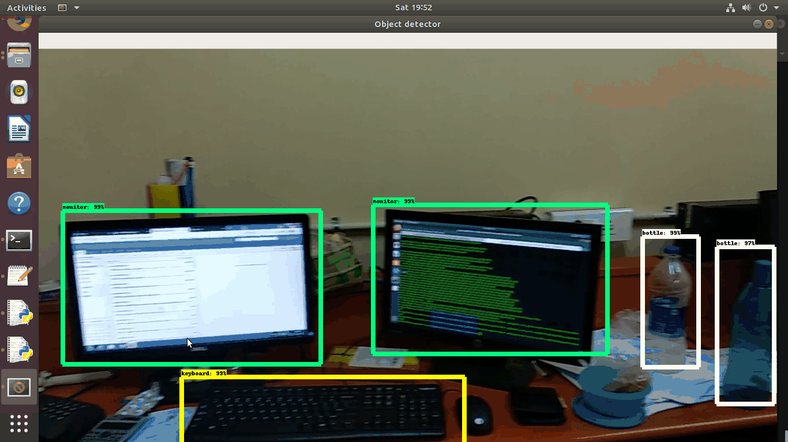

# Real-time-object-detection
In this repositery i have developed real-time-object-detection using tensorflow. I have run this project on Ubuntu, but i believe this will also run successfully on windows with minor changes. Also i used CPU, if you are using GPU then i believe you have installed TensorFlow-GPU, and set-up Object Detection directory structure and Anaconda Virtual Environment (setting up Anoconda environment is optional). The folowing .gif file shows output of program trained with 6 classes (computer monitor, keyboard, printer, water bottle, mouse, telephone and calculator).

In this tutorial, i assume that you have successfully installed Object Detection API. You can test it out and verify your installation is working by launching the object_detection_tutorial.ipynb script with Jupyter. In this tutorial we used Faster-RCNN-Inception-V2-COCO model from TensorFlow's model zoo. Download and open faster_rcnn_inception_v2_coco_2018_01_28.tar.gz file with a file archiver such as WinZip or 7-Zip and extract the faster_rcnn_inception_v2_coco_2018_01_28 folder to the object_detection under C:\...\models\research\object_detection.

# Run the Training
 From the \object_detection directory, issue the following command to begin training:
 
 python train.py --logtostderr --train_dir=training/ --pipeline_config_path=training/faster_rcnn_inception_v2_pets.config
 
 If everything has been set up correctly, TensorFlow will initialize the training. The initialization can take up to 30 seconds before the actual training begins.
 
 # Classify new image using trained model:
 To test your object detector, move a picture of the object or objects into the \object_detection folder, and change the IMAGE_NAME variable in the Object_detection_image.py to match the file name of the picture. 
 To run any of the scripts, type “idle” in the Anaconda Command Prompt (with the “tensorflow1” virtual environment activated) and press ENTER. This will open IDLE, and from there, you can open any of the scripts and run them.

If everything is working properly, the object detector will initialize for about 10 seconds and then display a window showing any objects it’s detected in the image!

Alternatively, you can use a video of the objects (using Object_detection_video.py), or just plug in a USB webcam and point it at the objects (using Object_detection_webcam.py). 
      

 

